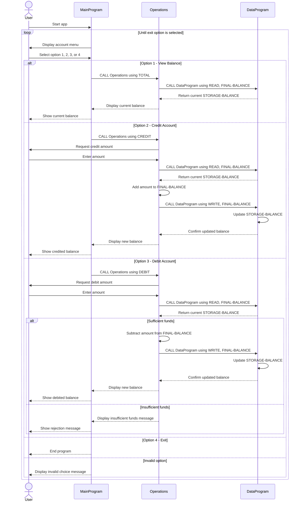

# COBOL Student Account Documentation

This document describes the COBOL programs under [src/cobol/data.cob](src/cobol/data.cob), [src/cobol/main.cob](src/cobol/main.cob), and [src/cobol/operations.cob](src/cobol/operations.cob). Together, these files implement a simple student account management flow that lets a user review the current balance, add funds, or debit funds.

## File Overview

### [src/cobol/main.cob](src/cobol/main.cob)

Purpose:
Acts as the entry point and user interface for the student account system.

Key logic:
- Displays a menu with four options: view balance, credit account, debit account, and exit.
- Reads the user's numeric menu selection into `USER-CHOICE`.
- Routes the request to `Operations` using one of these operation codes:
  - `TOTAL ` for balance inquiry
  - `CREDIT` for adding funds
  - `DEBIT ` for subtracting funds
- Repeats until the user selects option 4.

Notes:
- Operation codes are fixed-width six-character values, so `TOTAL ` and `DEBIT ` include trailing spaces.
- Invalid menu choices do not stop the program; the menu is shown again.

### [src/cobol/operations.cob](src/cobol/operations.cob)

Purpose:
Contains the core account transaction logic for balance inquiry, credit, and debit operations.

Key logic:
- Receives an operation code from `MainProgram`.
- Calls `DataProgram` with `READ` to fetch the current balance before processing.
- For `TOTAL `:
  - Reads the current balance and displays it.
- For `CREDIT`:
  - Prompts for an amount.
  - Reads the current balance.
  - Adds the entered amount.
  - Writes the updated balance back through `DataProgram`.
  - Displays the new balance.
- For `DEBIT `:
  - Prompts for an amount.
  - Reads the current balance.
  - Checks whether enough funds are available.
  - If funds are sufficient, subtracts the amount and writes the new balance.
  - If not, displays an insufficient funds message and leaves the balance unchanged.

Notes:
- `FINAL-BALANCE` is initialized to `1000.00`, but the effective source of truth during runtime is the value read from `DataProgram`.
- The program assumes numeric user input for transaction amounts.

### [src/cobol/data.cob](src/cobol/data.cob)

Purpose:
Provides a simple shared storage layer for the account balance.

Key logic:
- Maintains `STORAGE-BALANCE`, initialized to `1000.00`.
- Accepts an operation type through the linkage section.
- Supports two storage actions:
  - `READ`: copies `STORAGE-BALANCE` into the passed balance field.
  - `WRITE`: updates `STORAGE-BALANCE` with the passed balance value.

Notes:
- This behaves like in-memory persistence for the current run of the program.
- There is no file or database backing store, so the balance resets to the initial value when the program starts again.

## Business Rules for Student Accounts

- Every student account starts with a balance of `1000.00`.
- A balance inquiry does not change account data.
- A credit operation increases the balance by the amount entered by the user.
- A debit operation decreases the balance only when the current balance is greater than or equal to the requested amount.
- If a debit amount exceeds the current balance, the transaction is rejected.
- The balance is shared across operations during a single execution by reading from and writing to `DataProgram`.
- The system uses a single account balance; there is no student identifier, multi-account support, or transaction history.
- Input validation is minimal:
  - menu validation handles unsupported menu choices
  - transaction validation does not explicitly prevent zero, negative, or malformed numeric amounts

## Program Interaction Flow

1. `MainProgram` displays the account menu.
2. The user selects an action.
3. `MainProgram` calls `Operations` with the corresponding six-character code.
4. `Operations` calls `DataProgram` to read or write the balance.
5. The result is displayed to the user.
6. Control returns to `MainProgram` until the user exits.

## Current Constraints

- Persistence is runtime-only.
- The design supports one shared balance, not separate student accounts.
- Transaction amounts are accepted directly from user input without additional business validation.
- Operation routing depends on exact fixed-length codes.

## Sequence Diagram

